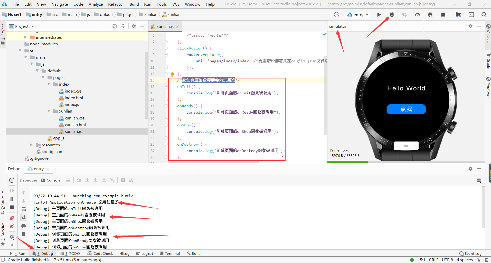
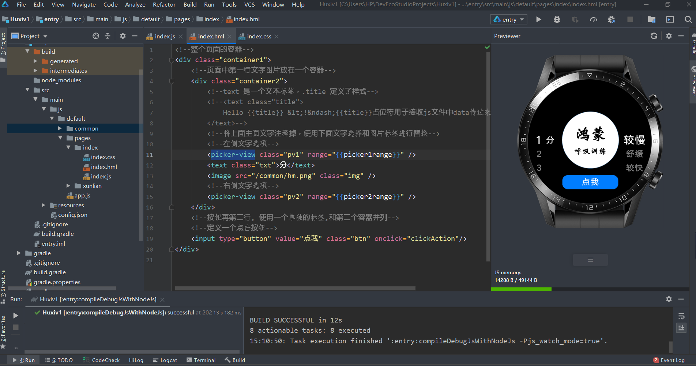
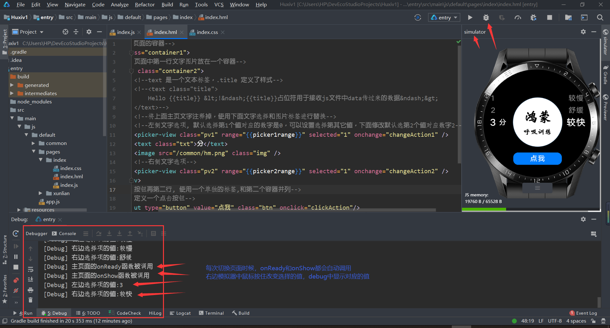
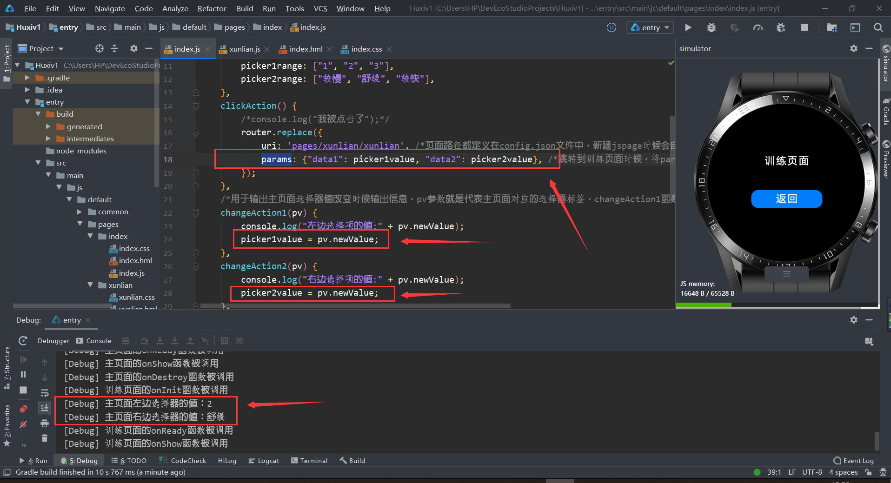
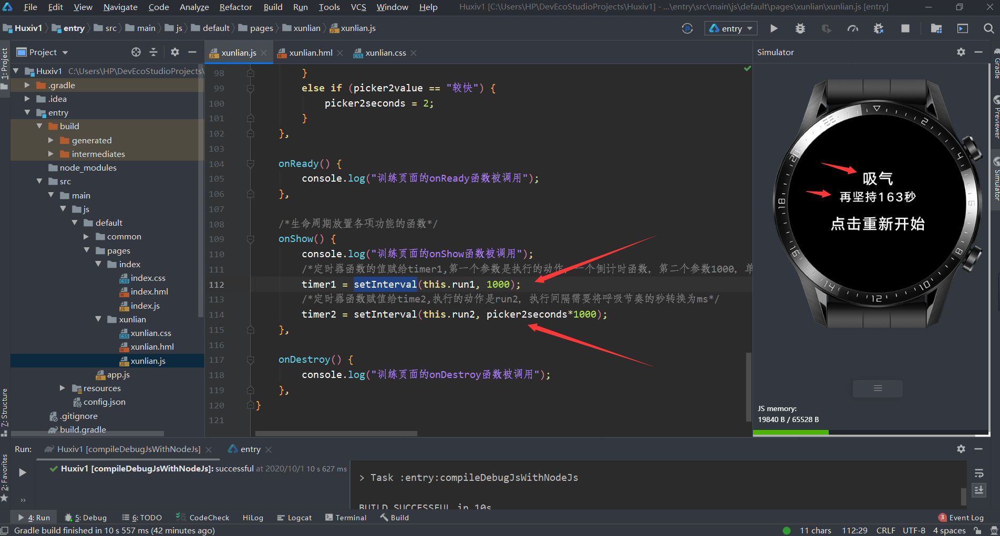

# 华为鸿蒙系统项目实战之运动手表呼吸App

# 1 安装华为鸿蒙系统开发环境
- 鸿蒙系统官方文档：https://developer.harmonyos.com/cn/documentation
- 必须组件：
    - node.js 
    - DevEco Studio IDE
    - gradle 组件
- 安装教程参考：
    - [鸿蒙系统（HarmonyOS2.0）开发环境搭建图文教程（DevEco Studio IDE 安装及设置）](https://blog.csdn.net/u011318077/article/details/108578354)
    
- 代码运行问题：
    - DevEco Studio IDE并不会实时刷新代码，因此修改代码点击后不会看到修改的结果
    - 预览模式或者调试模式刷新代码：
        - 右侧上部有刷新按钮(调试模式无)；
        - 右侧上部js重新实时编译按钮(restart realtime compiling) 
        - 底部左侧，run，运行以下代码
    
# 2 创建项目
- 打开软件，创建运动手表项目，查看图片
- 项目创建后，会自动下载 gradle 组件，类似一个项目管理工具

# 3 项目界面介绍
- 华为运动手表项目主要三类组成文件：.hml .css .js ，三个文件关系参考下图：
- 查看图片
- 整个开发窗口类似安卓开发IDE界面，view---tool windows---previewer, 可以打开 app 预览窗口
- 注意有时候close all 窗口后，tool windows 下面的 previewer 选项没有了，此时双击打开 index 文件夹下的index.js 预览窗口会自动出来
- 查看图片

# 4 运动手表开发介绍
- 运动手表坐标系是固定的，高宽都是454px(表盘的最大高度和最大宽度，超出部分不显示)，左上角为原点坐标
- 查看图片
- 因为宽度高度都是固定的，因此css样式可以直接写像素px值来定义各种字体大小，高度宽度等等样式

# 5 主页面添加点击按钮：debug 模式运行模拟器
- 手表页面添加一个手表功能，然后debug模式运行
- debug模式运行，先生成一个模拟器，然后点击手表按钮，debug窗口查看运行结果
- 查看图片
- 查看图片

# 6 添加训练页面，主页面子页面相互跳转
- pages 文件夹负责每个页面的编写
- pages 文件夹下新建 js page 文件
- 将 index 文件夹中的 css hml js文件里面的代码复制到 xunlian 文件夹中对应的文件中，进行修改
- 主要 js 文件中要使用 router.replace() 函数进行页面之间的跳转，具体查看 Huxiv1 项目中代码

# 7 应用和页面的生命周期事件验证

- 应用和页面的生命周期查看图片
- app.js 里面默认实现了了应用创建和应用销毁的 debug 调试函数
- 使用右上角小虫子按钮 debug 模式运行手表模拟器，底部debug 窗口里面可以查看 debug 信息
- 查看图片

- 主页面index.js和训练页面中的xunlian.js的自定义功能中添加验证页面生命周期的调试函数
- 然后右上角小虫子按钮进入debug模式，运行手表模拟器
- 查看图片

- 补充：
    - 鸿蒙手表应用没有后台，程序只会显示当前页面，
    - 一个页面切换到另外一个页面，上一个页面就自动销毁了
    - 图片009中的函数就可以看出，主页面切换到训练页面，主页面关闭时候调用了onDestroy 函数
    - 该函数默认就是销毁页面，鸿蒙应用会自动实现，上面写出来是为了进行调试，显示整个页面生命周期过程

# 8 主页面添加图片Logo和两个选择器
- 图片logo两个选择器放在一个容器2中，元素水平排列 flex-direction: row;
- 点击按钮是容器1中和容器2并列的元素，容器1中的元素垂直排列
- 选择器使用了 picker-view 标签，里面的值使用 range 属性，由index.js文件中的data传值过来
- 具体查看项目中index文件夹中的各个文件及注释
- 完成后效果查看图片

# 9 主页面选择器值改变打印调试信息
- 选择器添加onchange属性，对应自定义一个changeAction函数（函数用于debug模式下输出信息）
- 具体查看项目中的index文件夹中的各个文件及注释
- 查看图片

# 10 值的传递-主页面的值传递到训练页面
- 主页面js文件中定义空变量，用于获取到选择器的值，
- 然后通过clickAction() 函数传递uri的同时传递params
- 将值赋值给字典，训练页面通过this.data1取出，然后赋值给picker
- 然后通过if else 语句判断后，将分钟转换为秒数
- this表示当前操作的对象，即执行点击时候执行的对象
- 具体查看项目中的index文件夹中的各个文件及注释
- 查看图片

# 11 训练页面倒计时显示剩余秒数，交替显示吸气呼气
- 训练页面通过两个定时器函数，分别实现倒计时和交替显示
- 定时器函数setInterval，第一个参数为定时器要执行的功能，第二个参数是执行的间隔时间
- 注意，每次定时器函数执行结束后，需要清空定时器
- 具体查看项目中的index文件夹中的各个文件及注释
- 查看图片

# 12 吸气呼气显示进度百分比，结束后显示100%，同时添加一个旋转的图片
- 设置定时器函数，间隔就是吸气的时间除以100，然后执行0加1，一直加到100
- 设置一个图片，然后添加一个旋转动画样式，动画具体执行的动作定义在css样式里面
- 动画样式的参数，定义的js文件中
- 具体查看代码文件