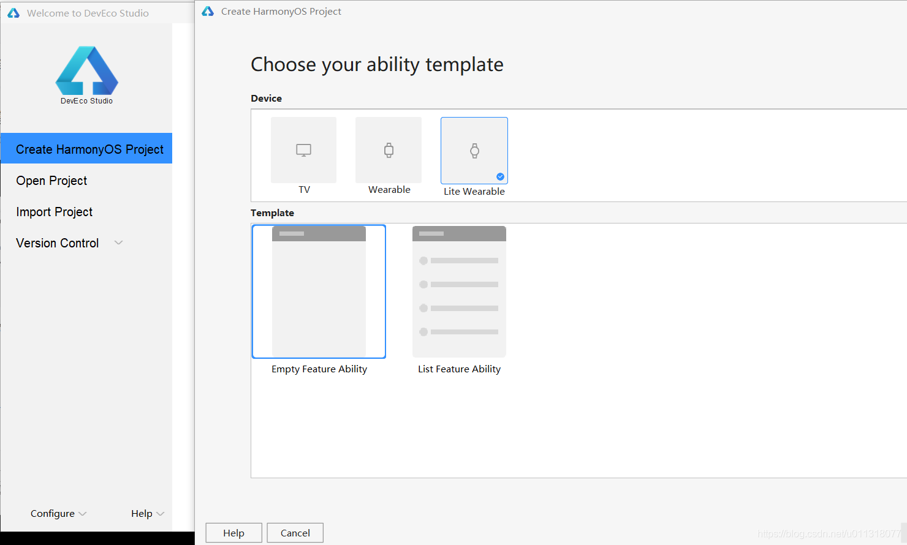
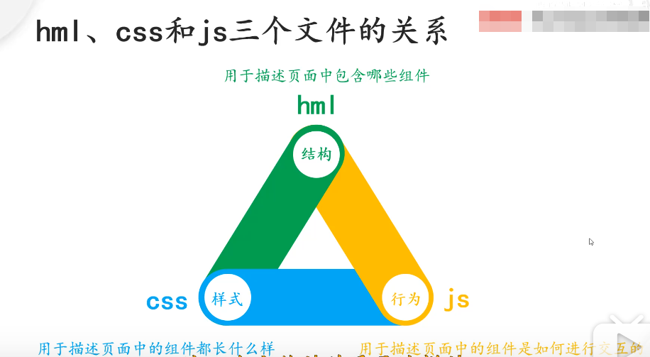
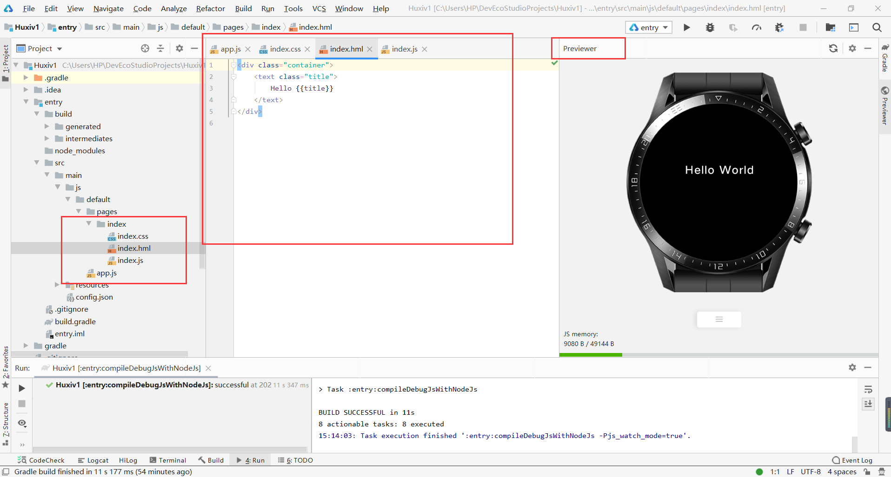
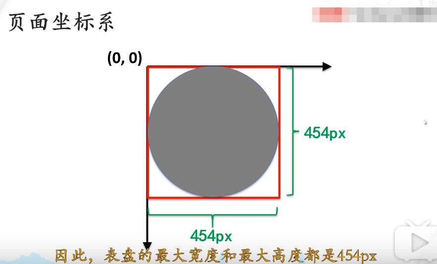
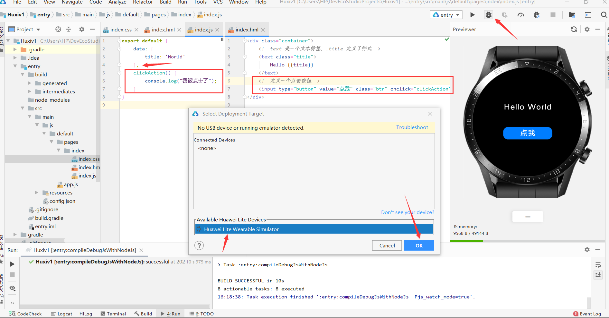
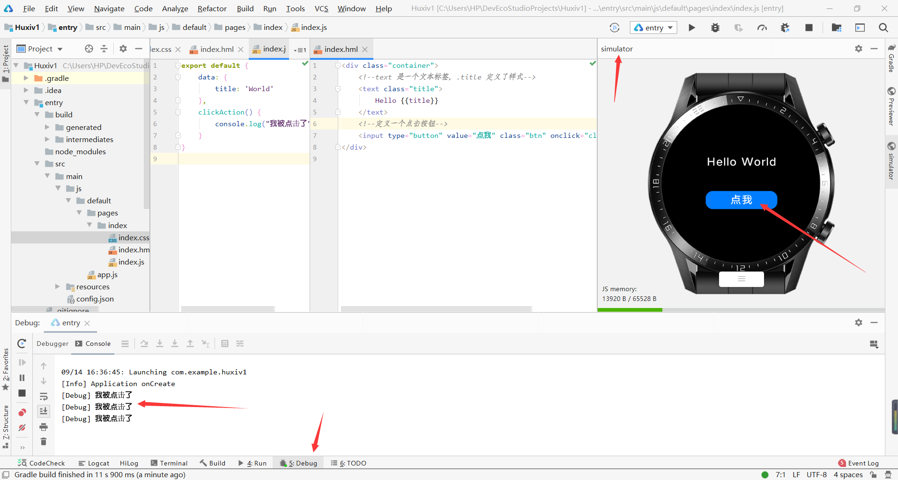
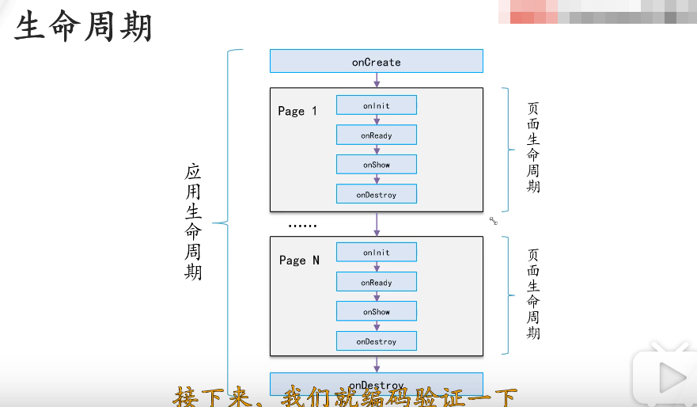
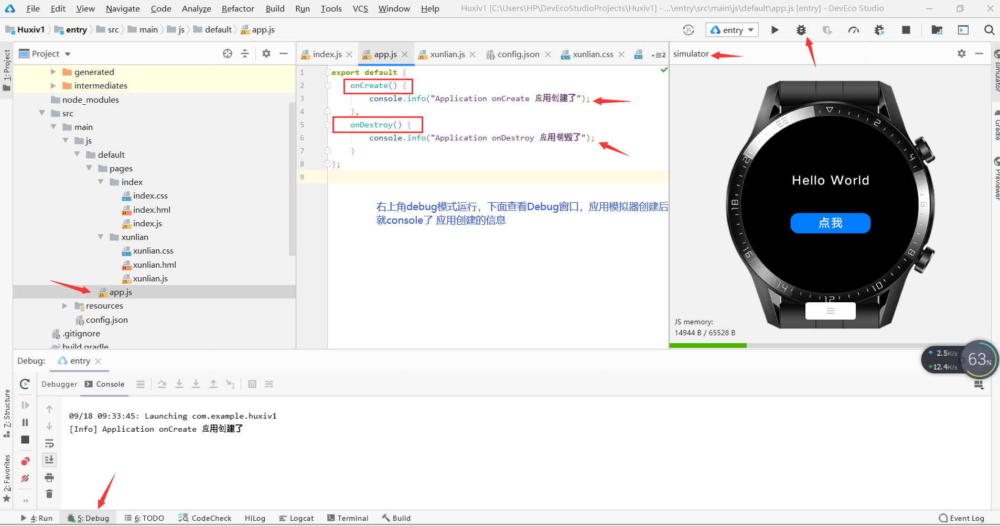

# 华为鸿蒙系统项目实战之运动手表呼吸App

# 1 安装华为鸿蒙系统开发环境
- 必须组件：
    - node.js 
    - DevEco Studio IDE
    - gradle 组件
- 安装教程参考：
    - [鸿蒙系统（HarmonyOS2.0）开发环境搭建图文教程（DevEco Studio IDE 安装及设置）](https://blog.csdn.net/u011318077/article/details/108578354)
    
# 2 创建项目
- 打开软件，创建运动手表项目，查看图片
- 项目创建后，会自动下载 gradle 组件，类似一个项目管理工具

# 3 项目界面介绍
- 华为运动手表项目主要三类组成文件：.hml .css .js ，三个文件关系参考下图：
- 查看图片
- 整个开发窗口类似安卓开发IDE界面，view---tool windows---previewer, 可以打开 app 预览窗口
- 注意有时候close all 窗口后，tool windows 下面的 previewer 选项没有了，此时双击打开 index 文件夹下的index.js 预览窗口会自动出来
- 查看图片

# 4 运动手表开发介绍
- 运动手表坐标系是固定的，高宽都是454px(表盘的最大高度和最大宽度，超出部分不显示)，左上角为原点坐标
- 查看图片
- 因为宽度高度都是固定的，因此css样式可以直接写像素px值来定义各种字体大小，高度宽度等等样式

# 5 主页面添加点击按钮：debug 模式运行模拟器
- 手表页面添加一个手表功能，然后debug模式运行
- debug模式运行，先生成一个模拟器，然后点击手表按钮，debug窗口查看运行结果
- 查看图片
- 查看图片

# 6 添加训练页面，主页面子页面相互跳转
- pages 文件夹负责每个页面的编写
- pages 文件夹下新建 js page 文件
- 将 index 文件夹中的 css hml js文件里面的代码复制到 xunlian 文件夹中对应的文件中，进行修改
- 主要 js 文件中要使用 router.replace() 函数进行页面之间的跳转，具体查看 Huxiv1 项目中代码

# 7 应用和页面的生命周期事件验证
- 应用和页面的生命周期查看图片
- app.js 里面定义了应用创建和应用销毁的 debug 调试函数
- 使用 debug 模式运行手表模拟器，底部debug 窗口里面可以查看 debug 信息
- 查看图片

# 8 